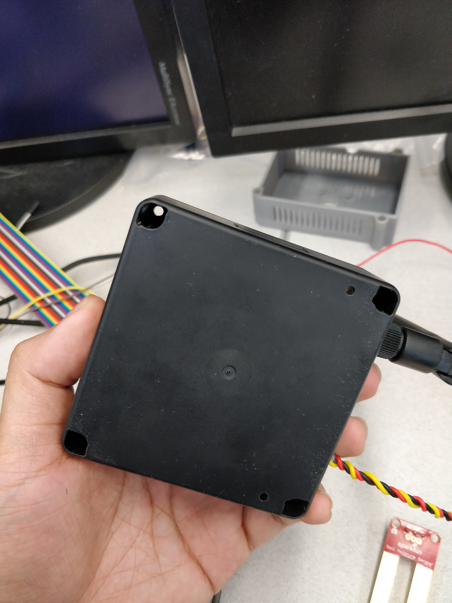
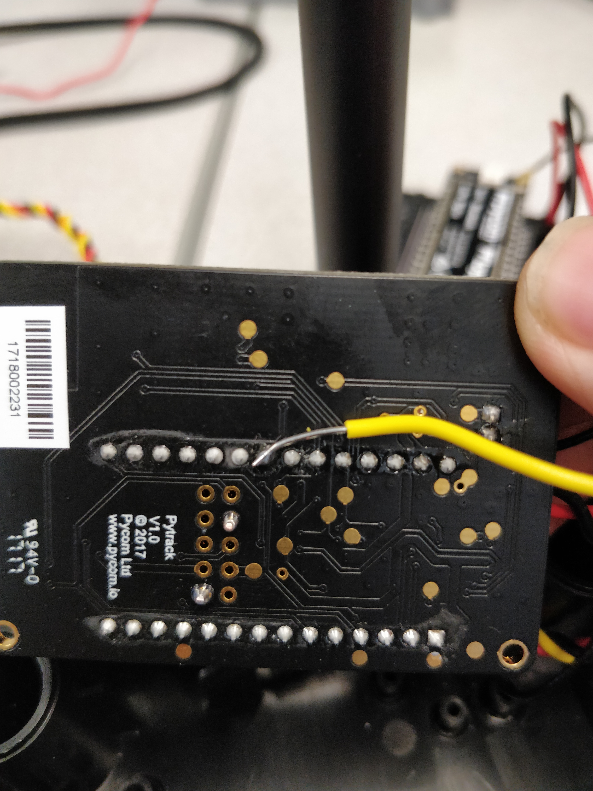
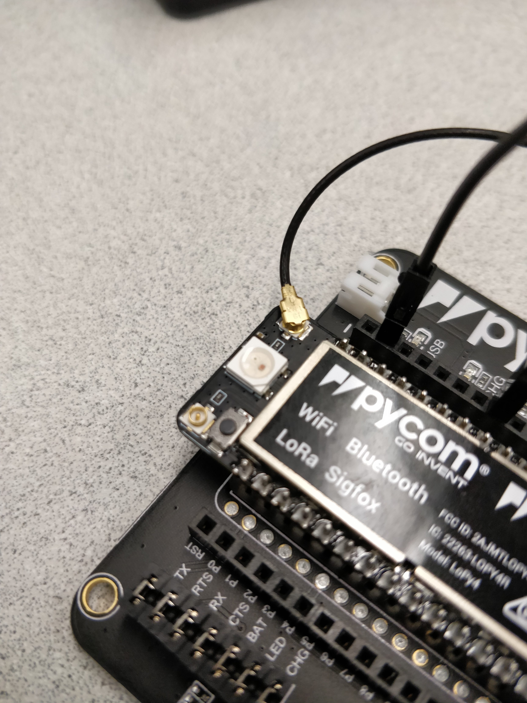
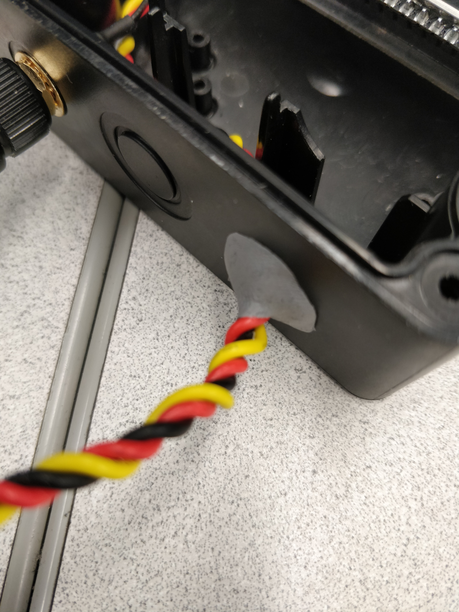

# Lopy 4 Soil Moisture Sensor - Pytrack Build Instructions

The Pytrack will give the device GPS capability allowing us to track the device and also use the location as an ID. 

1. Take the Universal IP67 Case and take the lid off by unscrewing the screws located in the 4 holes on the bottom

2. One of the sides of the case has three circular holes. Using a pen or screwdriver, punch in outer two holes. One is for the antenna and the other is for the moisture sensor. 

3. Dismantle the LoRa antenna kit by unscrewing the antenna, washer, and nut. Feed the connector side of the antenna from the inside of the leftmost hole as shown in the picture below. Place the washer and nut back to secure it into place. 

Screw the antenna back and tighten it until its oriented in the desired position. 

1. Insert the LoPy 4 into the pyTrack. Ensure that the side with the LED and the reset button are facing towards the USB connector. If oriented the wrong way it won't work. 

   
1. Take three hookup wires of the desired length and braid them together by first taking two wires and twisting them in a clockwise direction. Then taking the third wire with the first two, twist them in the counter-clockwise direction. Leave 1-2 inches at both ends unbraided as these will be connected to the sensor/expansion board. 

The end result should be similar to below.

6. Both ends of your braided cable should have 3 loose wires. Strip the 3 wires on one end, and connect them to the SIG, GND, and VCC terminals of the moisture sensor. 

7. Feed the rest of the wire through the remaining hole we created earlier. 

8. Unlike the expansion board, the Pytrack does not have external female headers for connections. Instead, it has an external IO header which can be soldered to as seen in the Pytrack diagram below. 

We use two of these external IO ports, GND(External IO Header Pin 1) and P11(External IO Header Pin 8).

The connections are as follows and are also shown in the picture below. 

* VCC --> soldered to external IO header 8
* GND --> soldered to external IO header 1

9. You should have one unconnected end left. The external IO header only connects to pins on the left side of the board, which cannot be used as an ADC. Therefore, the only way to connect the SIG terminal of the sensor to an ADC is to directly solder a hookup wire to an exposed ADC pin **underneath** the PyTrack as shown below. 

* SIG --> soldered to bottom of P19/G6

  

10. Connect the antenna to the board by connecting the u.fl connector to the top right SMA pig tail as shown below. 

10.  Upload the code within this folder by connecting the pytrack to a computer via USB and using the upload tool in the PyMakr extension for VSCode. 

## Weatherproofing (Optional)

1. To completely weatherproof the case we need to patch up the hole we made to feed the wires through as well as the exposed electronics on the moisture sensor. Sugru is a flexible putty, and can be molded. When it sets it is waterproof and long-lasting. 
2. Follow the instructions on the Sugru packaging and fill the hole that the wire is passed through.

3. Take some of the leftover Sugru and cover any exposed electronics on the moisture sensor. 

